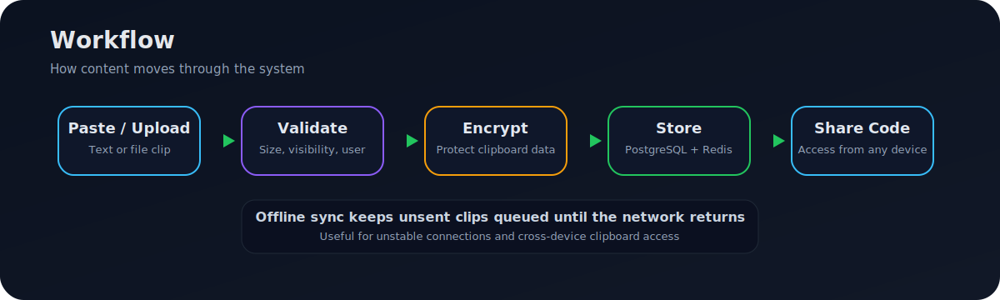
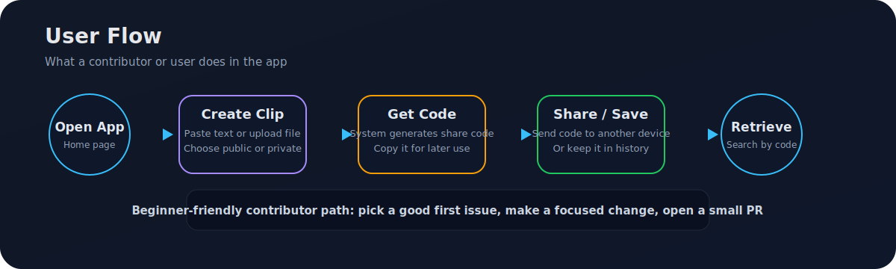

# 🌐 Online Clipboard


A modern web application that lets you **store, access, and share clipboard text across devices**.
Built with a **React frontend** and **Spring Boot backend**, it ensures your important snippets are always available—anytime, anywhere.

## 📸 Flows

### Workflow


### User Flow


---

## 🚀 Features

* 🔗 Save and retrieve text clips using short shareable codes
* 🔒 Public and private clipboard support
* 📱 Access clips across multiple devices
* 🧠 Offline sync for unsent clips
* 📜 Personal history + community clips
* ✏️ Update and delete saved clips
* ⚡ Backend health check for smooth startup
* 💀 Skeleton loaders for improved perceived performance during data fetching

---

## 🛠️ Tech Stack

**Frontend**

* React + Vite
* React Router
* Framer Motion
* Tailwind CSS

**Backend**

* Java 21
* Spring Boot
* Spring Security
* Spring Data JPA

**Database & Services**

* PostgreSQL
* Redis (caching & sync)
* Cloudinary (asset handling)

**Tooling**

* Maven
* ESLint

---

## 📦 Installation & Setup

### 1️⃣ Clone the repository

```bash
git clone https://github.com/Shaurya01836/online-clipboard.git
cd online-clipboard
```

---

### 2️⃣ Backend Setup

Set environment variables:

```bash
DB_URL=
DB_USERNAME=
DB_PASSWORD=
REDIS_HOST=
REDIS_PORT=
REDIS_PASSWORD=
CLOUDINARY_CLOUD_NAME=
CLOUDINARY_API_KEY=
CLOUDINARY_API_SECRET=
```

Start backend:

```bash
cd online-clipboard-backend
./mvnw clean install
./mvnw spring-boot:run
```

---

### 3️⃣ Frontend Setup

```bash
cd online-clipboard-frontend
npm install
npm run dev
```

---

### 4️⃣ Configure API (if needed)

Create `.env` in frontend:

```env
VITE_API_URL=http://localhost:8080/api
```

---

## ▶️ Usage

1. Start backend server
2. Start frontend
3. Open browser (Vite URL)
4. Create a clip → copy code → access anywhere

---

## 📁 Project Structure

```
online-clipboard/
├── online-clipboard-backend/
├── online-clipboard-frontend/
└── README.md
```

---

## 🤝 Contributing

We welcome contributions of all levels!

### 🛠️ How to contribute:

1. Fork the repo
2. Create a new branch
3. Make your changes
4. Test locally
5. Submit a Pull Request

### 🟢 Good first contributions:

* UI improvements
* Fix small bugs
* Improve documentation
* Add test cases

---

## 🤝 Contributors

Thanks to these amazing people:

<a href="https://github.com/Shaurya01836/online-clipboard/graphs/contributors">
	
</a>


## 📌 Roadmap

* 🔄 Real-time sync across devices
* 🔐 Authentication system
* 🛡️ End-to-end encryption
* 📡 Improved offline-first support
* 🚀 CI/CD & deployment automation

---

## 🐛 Issues

Found a bug or have an idea?

👉 Open an issue with:

* Steps to reproduce
* Expected behavior
* Screenshots (if possible)

---

## 📄 License

This project is licensed under the **MIT License**.
